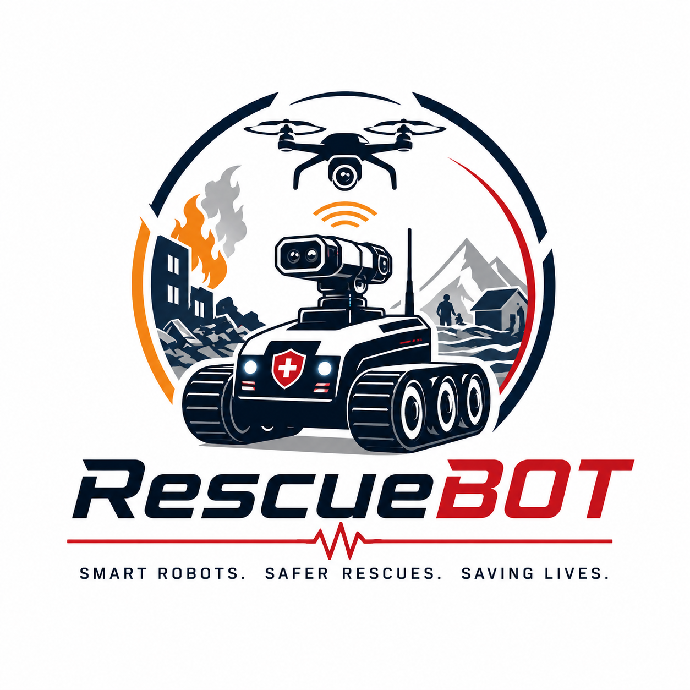
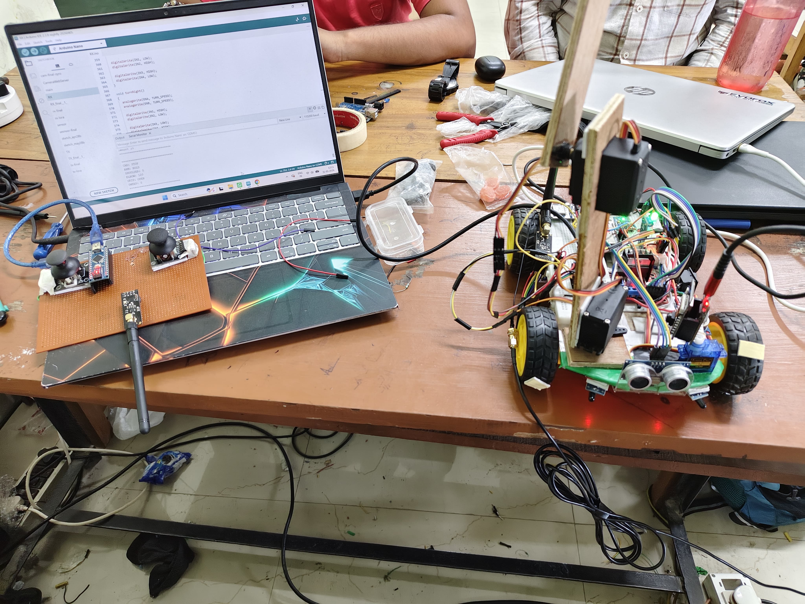
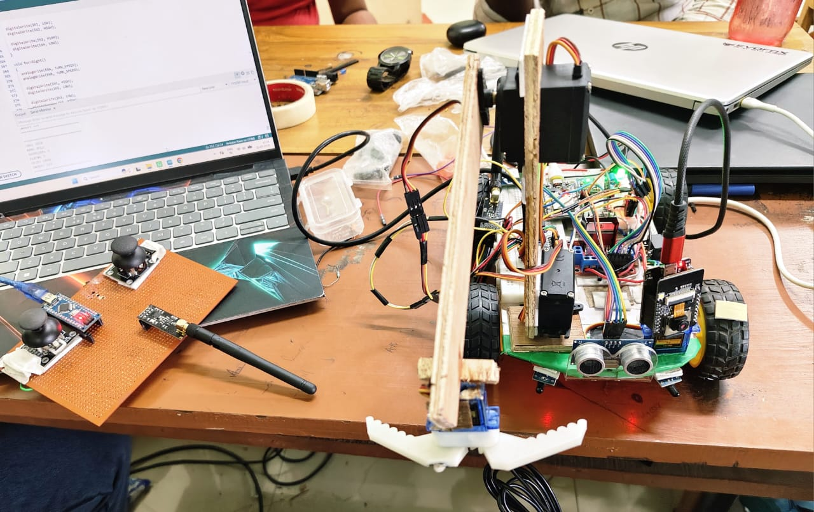
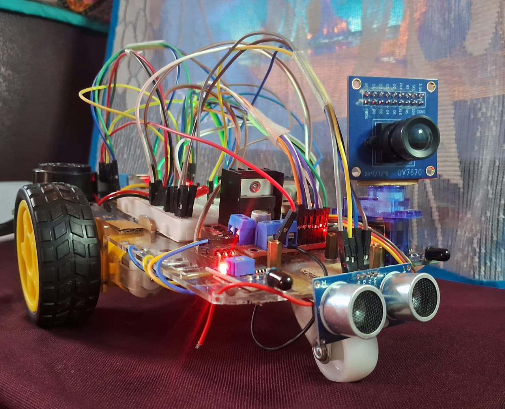
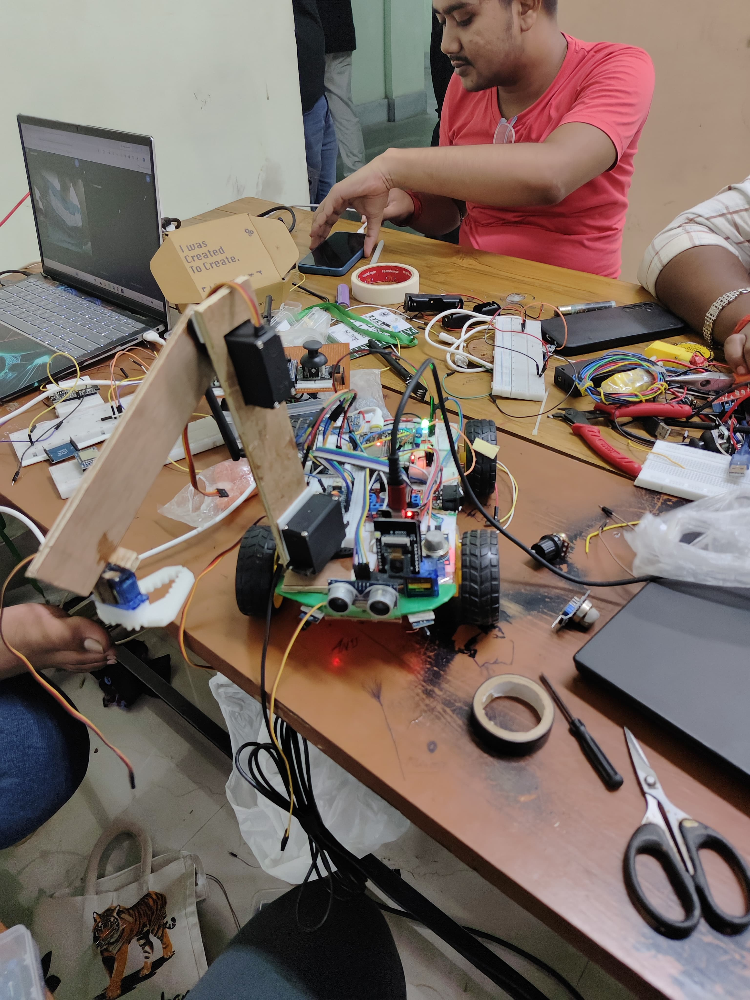
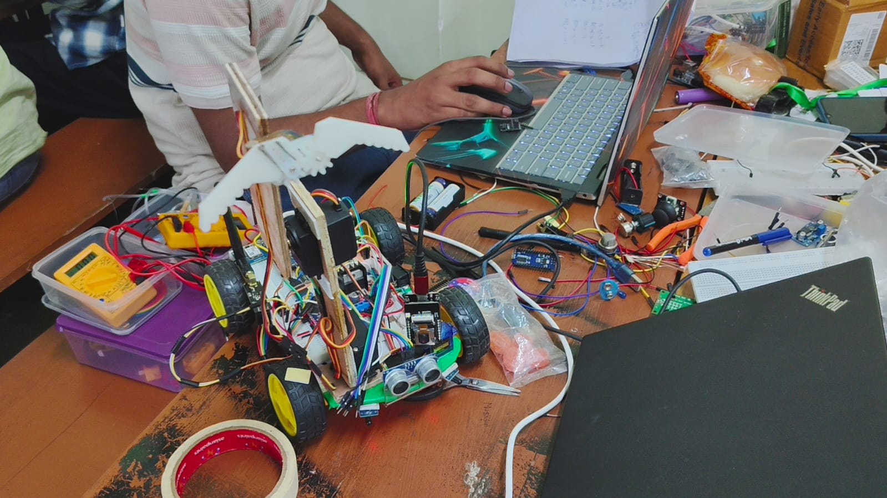
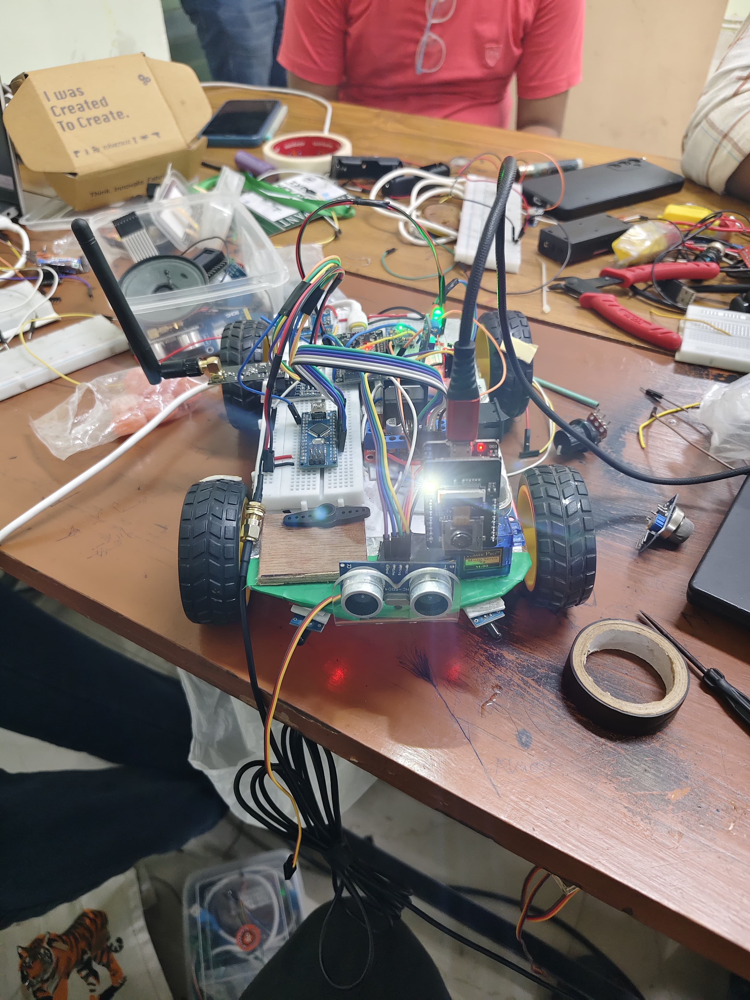
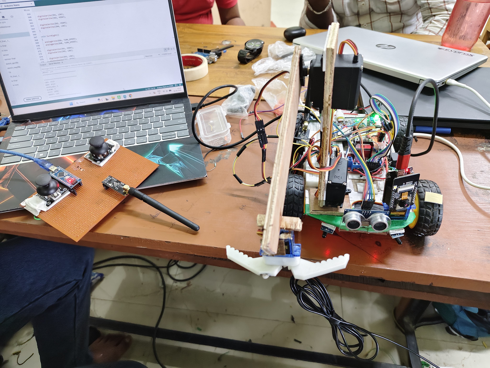
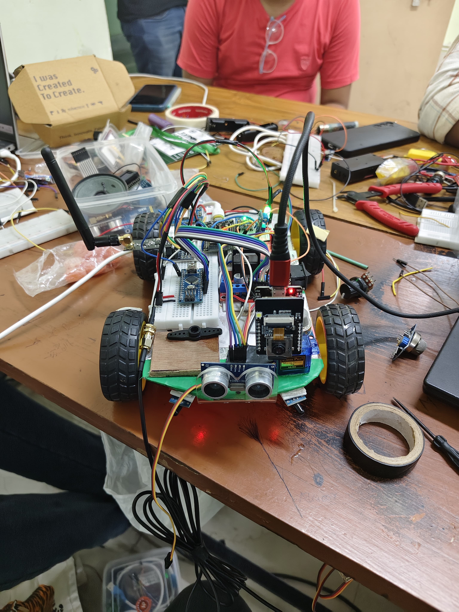
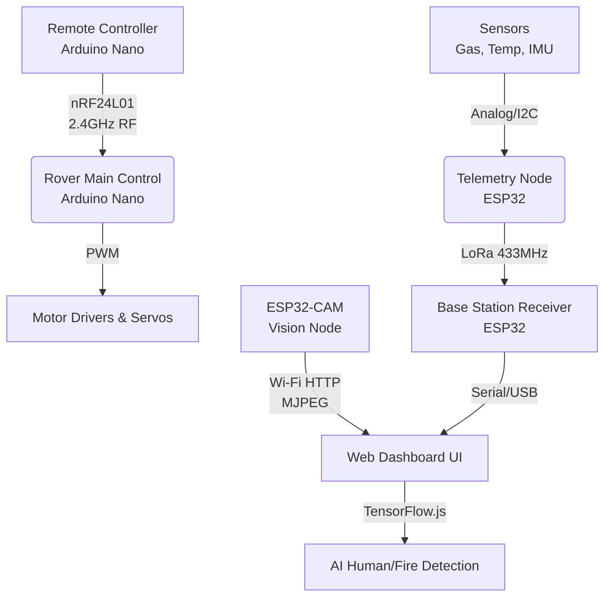

<div align="center">
  
  <h1>🤖 RescueBOT</h1>
  <p><b>Intelligent Multi-Disaster Rescue Robotic System</b></p>
  <p><i>A B.Tech Engineering Hackathon Project</i></p>

  [](https://opensource.org/licenses/MIT)
  []()
  []()
</div>

---

## 📖 About The Project

**RescueBOT** is an advanced, IoT-enabled multi-disaster rescue robotic system designed for hazardous environments where human intervention is dangerous or impossible. Built primarily with ESP32 microcontrollers, this rover platform integrates a robotic arm, real-time AI-assisted detection (Human/Fire), extensive sensor monitoring, and a robust hybrid communication system (NRF24L01 + LoRa + MQTT). 

It is tailored to provide real-time situational awareness and physical manipulation capabilities to first responders during earthquakes, fires, and industrial disasters.

## 🎥 Project Demo

<div align="center">
  <table>
    <tr>
      <td align="center"><br><em>Full Assembly</em></td>
      <td align="center"><br><em>Rover & Remote</em></td>
      <td align="center"><br><em>Field Testing</em></td>
      <td align="center"><br><em>Rover with Arm</em></td>
      <td align="center"><br><em>Robotic Arm Gripper</em></td>
    </tr>
    <tr>
      <td align="center"><br><em>Camera & LED Flash</em></td>
      <td align="center"><br><em>Isometric View</em></td>
      <td align="center"><br><em>Front View</em></td>
      <td align="center"><br><em>Demo Thumbnail</em></td>
      <td align="center"><video src="demo/rover_movement_test.mp4" height="120" controls muted></video><br><em>Movement Test</em></td>
    </tr>
    <tr>
      <td align="center"><video src="demo/arm_camera_movement_demo.mp4" height="120" controls muted></video><br><em>Arm Demo</em></td>
      <td align="center"><video src="demo/rescuebot_test.mp4" height="120" controls muted></video><br><em>Test</em></td>
      <td align="center"><video src="demo/rescuebot_demo.mp4" height="120" controls muted></video><br><em>Gen Demo</em></td>
      <td align="center"><video src="demo/rescuebot_overview.mp4" height="120" controls muted></video><br><em>Overview</em></td>
      <td></td>
    </tr>
  </table>
</div>

## 💻 Web Dashboard Interface

<div align="center">
  <table>
    <tr>
      <td align="center"><br><em>Home Page</em></td>
      <td align="center"><br><em>Dashboard Overview</em></td>
      <td align="center"><br><em>Sensor Telemetry</em></td>
    </tr>
    <tr>
      <td align="center"><br><em>Live GPS Map</em></td>
      <td align="center"><br><em>Camera & AI Feed</em></td>
      <td align="center"><br><em>System Alerts</em></td>
    </tr>
  </table>
</div>

## ✨ Key Features

- **📊 Multi-Sensor Environmental Telemetry Array**: Aggregates gas (MQ-2), vibration (SW-420), dual flame (KY-026), obstacle (HC-SR04), and tilt (MPU6050) data, plus live GPS coordinates.
- **👁️ Standalone Visual Surveillance System**: Dedicated ESP32-CAM providing an independent MJPEG live video stream and high-power PWM flash LED for low-light environments.
- **🦾 Drive Control & Actuation System**: 4WD differential drive chassis paired with a 4-DOF robotic arm (MG90S/SG90 servos) and a continuous sweeping sonar.
- **📡 Dual-Band Wireless Communication**: NRF24L01+ (2.4 GHz) for low-latency robotic control and LoRa SX1278 (433 MHz) for long-range sensor telemetry.
- **🚨 Local Safety & Alert System**: Autonomous on-board evaluation with physical red/green status LEDs, active buzzer alarm, and a 500 ms drive fail-safe.
- **💻 Web Dashboard & Telemetry Monitoring**: Real-time interface rendering live sensor gauges, alert statuses, GPS map views, and the live camera feed.

## 🛠️ Technology Stack

| Domain | Technologies Used |
| :--- | :--- |
| **Microcontrollers** | ESP32, ESP32-CAM |
| **Communication** | NRF24L01, LoRa, Wi-Fi (MQTT Protocol) |
| **Sensors** | Gas (MQ series), DHT11/22, MPU6050, Ultrasonic, Flame, Vibration, Neo-6M GPS |
| **Software/Firmware** | Embedded C/C++ (Arduino IDE/PlatformIO) |
| **Dashboard/UI** | HTML, CSS, JavaScript, MQTT Broker (e.g., Mosquitto) |

## 🏗️ System Structure



## 📂 Repository Structure

```text
RescueBOT/
├── firmware/
│   ├── lora_module/          # ESP32 LoRa TX (sensor telemetry) + RX (base station)
│   ├── nrf_communication/    # Arduino Nano TX (remote) + RX (chassis controller)
│   ├── cam_module/           # ESP32-CAM MJPEG stream server
│   ├── sensor_module/        # Sensor test sketches
│   ├── gps_module/           # GPS standalone test
│   └── libraries/            # Local library copies (RF24, LoRa, TinyGPS++, etc.)
├── circuit_diagram/
│   ├── circuit_explanation.md  # Full system wiring & functional block docs
│   ├── pin_connections.md      # Pin mapping tables for all 5 boards
│   └── circuit_schematic.jpeg  # Visual wiring schematic
├── docs/                     # 14-file technical documentation suite
│   ├── 01_Project_Overview.md
│   ├── 02_Problem_Statement.md
│   ├── 03_Objectives.md
│   ├── 04_Features.md
│   ├── 05_Innovation_and_USP.md
│   ├── 06_Working_Principle.md
│   ├── 07_System_Architecture.md
│   ├── 08_Tech_Stack.md
│   ├── 09_Implementation.md
│   ├── 10_Testing_and_Results.md
│   ├── 11_Challenges_and_Solutions.md
│   ├── 12_Future_Scope.md
│   ├── 13_Team_Details.md
│   └── 14_References.md
├── hardware/                 # Hardware specs, cost analysis
├── media/                    # Logo, component images, pin diagrams
├── demo/                     # Prototype photos and demo videos
├── hackathon_gallery/        # ZYRO 2026 event photos
├── presentations/            # PPTX + PDF presentations
├── website/                  # Web dashboard source (HTML/CSS/JS)
├── README.md
├── INSTALLATION.md           # Quick start guide
├── HARDWARE_SETUP.md         # Full hardware assembly guide
├── SOFTWARE_SETUP.md         # Firmware flashing & dashboard setup
├── CONTRIBUTING.md           # Contribution guidelines
├── CHANGELOG.md              # Version history
├── ROADMAP.md                # Future development plans
├── FAQ.md                    # Frequently asked questions
├── TROUBLESHOOTING.md        # Known issues & fixes
├── CODE_OF_CONDUCT.md        # Community standards
├── SECURITY.md               # Security policy & vulnerability reporting
└── LICENSE                   # MIT License
```

## 📂 Documentation Directory

To understand the project in depth, please refer to our detailed documentation files located in the `docs/` folder:

1. [Project Overview](docs/01_Project_Overview.md)
2. [Problem Statement](docs/02_Problem_Statement.md)
3. [Objectives](docs/03_Objectives.md)
4. [Features](docs/04_Features.md)
5. [Innovation and USP](docs/05_Innovation_and_USP.md)
6. [Working Principle](docs/06_Working_Principle.md)
7. [System Architecture](docs/07_System_Architecture.md)
8. [Tech Stack](docs/08_Tech_Stack.md)
9. [Implementation](docs/09_Implementation.md)
10. [Testing and Results](docs/10_Testing_and_Results.md)
11. [Challenges and Solutions](docs/11_Challenges_and_Solutions.md)
12. [Future Scope](docs/12_Future_Scope.md)
13. [Team Details](docs/13_Team_Details.md)
14. [References](docs/14_References.md)

## 🚀 Quick Start

For detailed instructions, see the [Implementation Guide](docs/09_Implementation.md) and [System Architecture](docs/07_System_Architecture.md).

1. Clone this repository.
2. Flash the Transmitter code to the Controller ESP32.
3. Flash the Receiver code to the Rover ESP32.
4. Flash the Camera code to the ESP32-CAM.
5. Launch the Web Dashboard (`index.html`).
   *(Note: The dedicated Web Dashboard repository can be found here: [Diaster_Rover_Dashboard](https://github.com/Prolayjit-B14/Diaster_Rover_Dashboard))*

## 👥 Team

<div align="center">
  <table>
    <tr>
      <td align="center"><br><em>Hackathon Selfie</em></td>
      <td align="center"><br><em>Team BOT THINGS</em></td>
      <td align="center"><br><em>ZYRO 2026 Hackathon</em></td>
      <td align="center"><br><em>Event Swag</em></td>
    </tr>
  </table>
</div>

Built with ❤️ by **Team BOT THINGS**, a group of 4 B.Tech Engineering Students.

**Contributors:**
- [Prolayjit-B14](https://github.com/Prolayjit-B14)
- [Arghya015](https://github.com/Arghya015)
- Subhajit Halder
- Papan Chowdhury

See [Team Details](docs/13_Team_Details.md) for full member info and academic details.

## 🤝 Contributing

Contributions, issues, and feature requests are welcome!
Feel free to check out the [issues page](https://github.com/Prolayjit-B14/RescueBOT/issues) and our [CONTRIBUTING.md](CONTRIBUTING.md) guidelines.

## 📜 License

This project is licensed under the MIT License - see the [LICENSE](LICENSE) file for details.

## 🙏 Acknowledgments

- **ZYRO 2026 Hackathon**: For providing the platform and inspiration to build this prototype.
- **Kalyani Government Engineering College (KGEC)**: For the resources and continued support.

---
<div align="center">
  <i>"Built for a safer tomorrow."</i>
</div>
